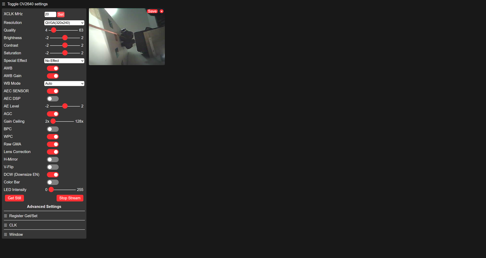
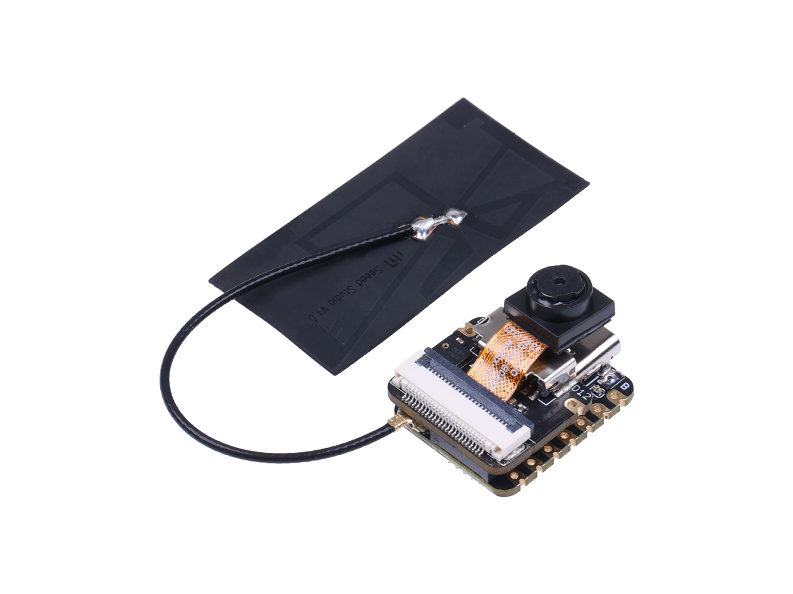
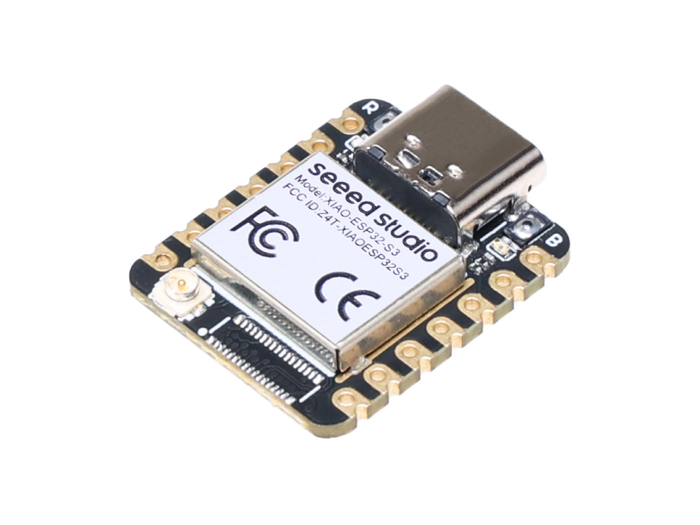

# IMPORTANT NOTES [delete me]

- FYI, [typora](https://typora.io/) can be used to output this doc to pdf format.

- Markdown is recommended from the requirement doc:

  ```plaintext
  Writing Tool: Whenever possible, write your tutorial using Markdown. For selected
  tutorials to publish online, it will save a lot of efforts if you are using Markdown.
  ```

- Use tables to contain the images for better readability.
  for example
  |XX|TT|
  |--|--|
  |||
  |Figure 1|Figure 2|

- Add screenshots to each step to improve clearity wherever possible

# ESP32-CAM Meets Vision Language Models: Building an Intelligent Vision System with Cloud LLMs

# Introduction

REQUIREMENTS: Explain the problem, context, and goals of the tutorial.

| Basic Structure? | Content filled? | Grammar? | Figures Added? | Formatted? |
| ---------------- | --------------- | -------- | -------------- | ---------- |
| Ok               | Ok              | Ok       |                |            |

In today's interconnected world, intelligent vision systems have become increasingly important for applications ranging from home security to industrial monitoring. Traditional vision systems often rely on pre-defined rules or local processing with limited capabilities. Meanwhile, large language models (LLMs) with vision capabilities have made tremendous advances in understanding and interpreting visual content with remarkable flexibility and accuracy.

Problem: Most microcontroller-based camera systems lack the computational power to run sophisticated vision intelligence models locally. While specialized computer vision models exist, they're typically limited to specific predefined tasks (like face detection or object counting) and require significant effort to retrain or adapt to new scenarios. Traditional cloud-based vision AI services can be complex to integrate with embedded hardware and often require dedicated SDKs or specialized knowledge.

Context: The ESP32-S3 is a powerful microcontroller with built-in Wi-Fi capabilities and camera support, making it an ideal platform for IoT vision applications. By connecting this hardware to cloud-based vision language models, we can create a system that combines the flexibility of edge computing with the intelligence of state-of-the-art AI.

What makes this approach particularly compelling is the adaptability of vision-capable LLMs. Unlike traditional computer vision systems that require extensive retraining for new tasks, LLMs can be directed to perform different analyses simply by changing a text prompt. This means your hardware can serve multiple purposes without any code changes or model updates.

Goals:

Build a complete intelligent vision system using the Seeed Studio XIAO ESP32S3 Sense
Establish reliable communication between the ESP32 camera and a computer serving as a processing hub
Implement motion detection to efficiently trigger image analysis
Connect the system to cloud-based vision language models for intelligent image interpretation
Create a practical application that demonstrates the capabilities of this integrated system
Showcase how LLM-based vision analysis can be easily reconfigured for different tasks
The power of this approach lies in its simplicity and flexibility. Vision-capable LLMs can understand images with impressively high accuracy at relatively low cost. More importantly, their capabilities can be redirected with minimal effort by simply changing a text prompt. This means your ESP32 camera system can serve as a versatile platform for countless applications—from monitoring package deliveries to identifying wildlife to ensuring proper equipment usage—all without requiring hardware modifications or complex software updates.

# Prerequisites

REQUIREMENTS: List required knowledge, tools, or equipment.

| Basic Structure? | Content filled? | Grammar? | Figures Added? | Formatted? |
| ---------------- | --------------- | -------- | -------------- | ---------- |
| Ok               | Ok              | Ok       |                |            |

Before starting this tutorial, you should have:

Knowledge:

Basic understanding of Arduino programming
Familiarity with Python programming
Basic understanding of OpenAI APIand HTTP requests

Hardware:

Seeed Studio XIAO ESP32S3 Sense with camera module
Wi-Fi antenna (included with the XIAO ESP32S3)
USB-C cable for power and programming
Computer with internet connection
Network with internet access (without captive portal verification requirements)

Software:

Python 3.9 or newer
Git (for cloning the repository)
Conda or another Python environment manager (recommended)
Access to a vision-capable LLM API (like VolcES vision model, GPT-4V, Claude, etc.)

API Access:

An API key for a vision-capable LLM service
For this tutorial, we'll be using a VolcES vision model accessed through an OpenAI-compatible endpoint
Other compatible services include OpenAI's GPT-4V and Anthropic's Claude

# Steps

REQUIREMENTS: Detailed instructions with diagrams, screenshots, or code
snippets.

| Basic Structure? | Content filled?          | Grammar?           | Figures Added? | Formatted? |
| ---------------- | ------------------------ | ------------------ | -------------- | ---------- |
| Ok               | Need to add more details | Need further check | Need more      |            |

## Hardware preperation

In this tutorial, we are going to use Seeed Studio XIAO ESP32S3 Sense module. This board is very tiny, and has a tiny camera extension as well, that can be connected with the main board with a socket with no effort.






### IDE setup

We are using Arduino with ESP32 configuration set.

1. Install the [lastest version](https://www.arduino.cc/en/software) of Arduino IDE

2. Insert Additional Board Manager

   - For Windows
   - Navigate to File > Preferences, and fill "Additional Boards Manager URLs" with the url below:

```plaintext
https://raw.githubusercontent.com/espressif/arduino-esp32/gh-pages/package_esp32_index.json
```

- For MacOS
- Navigate to Arduino IDE > Preferences, and fill "Additional Boards Manager URLs" with the url below:

```plaintext
https://raw.githubusercontent.com/espressif/arduino-esp32/gh-pages/package_esp32_index.json
```

3. Navigate to Tools > Board > Boards Manager..., type the keyword esp32 in the search box, select the latest version of esp32, and install it.

4. Select Board and Port

   - Select XIAO_ESP32S3 and the corresponding port number

5. Navigate to Tools > PSRAM > Select `OPI PSRAM`

### Compile the code and upload to board

1. Click to open the esp32 project at `./cam/cam.ino`

2. Insert your own credentials

   - Get your own WIFI credentials by copying credential.h.template, and rename it into credential.h, then fill your WIFI credential in it.

3. Upload the program to your board!

## Computer side software configuration

Personal computer is used as a server to receive the images captured by the camera, then python scripts and various libraries can be used to do movement detection, and only upload to LLM if the image changed quite a bit to reduce LLM points used, image post-processing (object segmentation, mono-colorize for better performance of LLM input, image compression for lower cost introduced).

Then the image is sent via internet to vision LLMs for interpretation, with a configurable detection target.

### Connections to made

1. Ensure your computer is connected to the same Wifi as your board, and use a usb lable to connect your board with your computer both for power supply and serial communication purposes. The images are sent via Wifi from the esp32 board to your computer, however, the communication from your computer back to the board to indicate the presence is currently using serial for simplicity of demonstration and extendability.

2. Open up the browser and input the ip address `http://192.168.8.189/`


3. Reduce the resolution to 128x128 for more stable image transfer.

### Configurations

1. The repo of the software is located under `./home_server/`, copy and paste `custom_config.py.template` to create your own version of `custom_config.py`, and fillin the fields correspondingly.

### Python environment setup

```shell
conda create -n smart-cam python=3.9 -y
conda activate smart-cam
pip install -r home_server/requirements.txt
python home_server/main.py
```

## Demonstration

REQUIREMENTS: Showcase results, simulations, or examples.

| Basic Structure? | Content filled? | Grammar? | Figures Added? | Formatted? |
| ---------------- | --------------- | -------- | -------------- | ---------- |
| Ok               |                 |          |                |            |

### Structure [delete me]:

Demonstrate the entire process:

- internet & wire connection
- select a customized detecting objective in the config file
- a recorded video that demonstrates the entire detection process
  - with / without the object inside the camera region
  - terminal output from computer
  - board LED changed accordingly

## Conclusion

REQUIREMENTS: Summarize key takeaways and suggest further reading or
applications.

| Basic Structure? | Content filled?            | Grammar? | Figures Added? | Formatted? |
| ---------------- | -------------------------- | -------- | -------------- | ---------- |
| Ok               | GPTed, not so fruitful tho | Ok       |                |            |

This tutorial demonstrates how to build a powerful intelligent vision system by combining the capabilities of the ESP32-S3 microcontroller with cloud-based vision language models. The resulting system showcases the potential of bridging edge computing with advanced AI capabilities.

### Key Takeaways

- **Flexibility of Vision LLMs**: Unlike traditional computer vision systems that require specialized training for each task, vision-capable LLMs can be redirected to detect different objects or analyze different scenarios simply by changing the prompt. We saw this in action by configuring the detection target through a simple text parameter.

- **Efficient Resource Usage**: By implementing motion detection and intermediary processing on a local computer, we minimize the number of API calls to the cloud LLM service. This approach optimizes both bandwidth usage and API costs while maintaining responsive detection.

- **Low Entry Barrier**: This project demonstrates that sophisticated vision AI applications are now accessible to hobbyists and small-scale developers. The combination of affordable hardware like the XIAO ESP32S3 Sense and pay-as-you-go LLM APIs removes the traditional barriers of specialized knowledge and expensive equipment.

- **Practical Applications**: The system we've built has immediate practical applications in areas like:
  - Home security and monitoring
  - Wildlife observation
  - Retail inventory management
  - Industrial quality control
  - Assisted living environments

### Limitations and Considerations

- **Internet Dependency**: The system requires a stable internet connection to function. For critical applications, consider implementing fallback mechanisms for offline operation.

- **Latency**: There is an inherent delay between image capture and analysis due to network transmission and API processing time. This makes the system less suitable for applications requiring real-time responses measured in milliseconds.

- **Privacy**: Images are sent to external API servers for processing. For applications involving sensitive data, consider the privacy implications and explore options for local processing or encrypted transmission.

### Future Enhancements

Several exciting possibilities exist for extending this project:

1. **Multiple Detection Targets**: Enhance the system to monitor for several different objects simultaneously by using more complex prompts that ask the LLM to identify multiple items.

2. **Temporal Analysis**: Implement a memory system that allows the LLM to reference previous images and track changes over time, enabling more sophisticated monitoring.

3. **Two-Way Integration**: Expand the feedback loop where LLM responses trigger specific actions on the ESP32, such as activating additional sensors or actuators based on what's detected.

4. **Edge-AI Hybrid**: Add lightweight local models for preliminary filtering, using the cloud LLM only for uncertain cases or more detailed analysis.

5. **Web Dashboard**: Create a web interface to view the camera feed, LLM interpretations, and historical detection data.

By building this system, you've gained practical experience with the integration of hardware, networking, and AI technologies—skills that are increasingly valuable in our connected world. The architecture demonstrated here provides a foundation that can be adapted to countless other intelligent vision applications, limited only by your imagination and the ever-expanding capabilities of vision language models.

Whether you're using this system for practical applications or as a learning platform, the combination of edge computing and cloud AI represents a powerful paradigm that will continue to grow in importance as our world becomes increasingly automated and intelligent.

## References

REQUIREMENTS: List any articles, books, or resources you used. All work must be
original and properly cited.

| Basic Structure? | Content filled?                | Grammar? | Figures Added? | Formatted? |
| ---------------- | ------------------------------ | -------- | -------------- | ---------- |
| /                | No, need more online resources | /        | /              |            |

Add references, like youtube videos / volc API book (for the python & LLM part), and sample code offered by esp32 community that makes this tutorial so much easier.

[Seeed Studio's tutorial](https://wiki.seeedstudio.com/xiao_esp32s3_getting_started/)

[DroneBot's Video](https://www.youtube.com/watch?v=qNzlytUdB_Q)

## Acknowledgement

REQUIREMENTS: Acknowledge any sources for help, including AI tools. A
contribution statement is required if the tutorial is a teamwork.

| Basic Structure? | Content filled? | Grammar? | Figures Added? | Formatted? |
| ---------------- | --------------- | -------- | -------------- | ---------- |
| GPT it           | GPT it          | GPT it   |                |            |

GPT it
